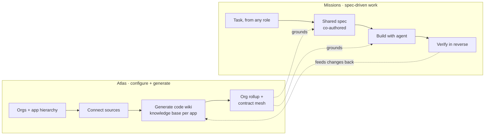
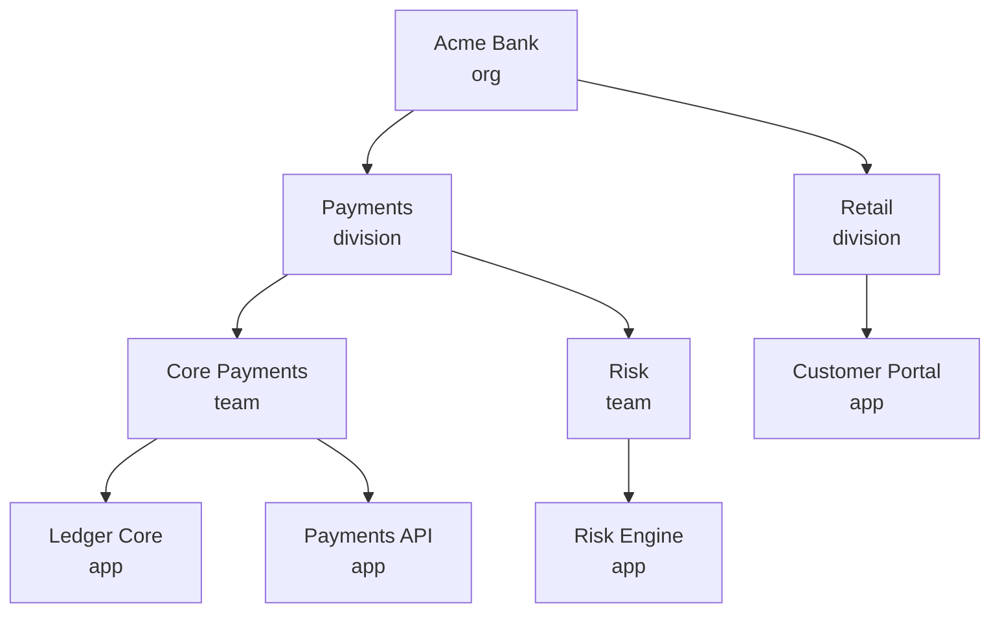
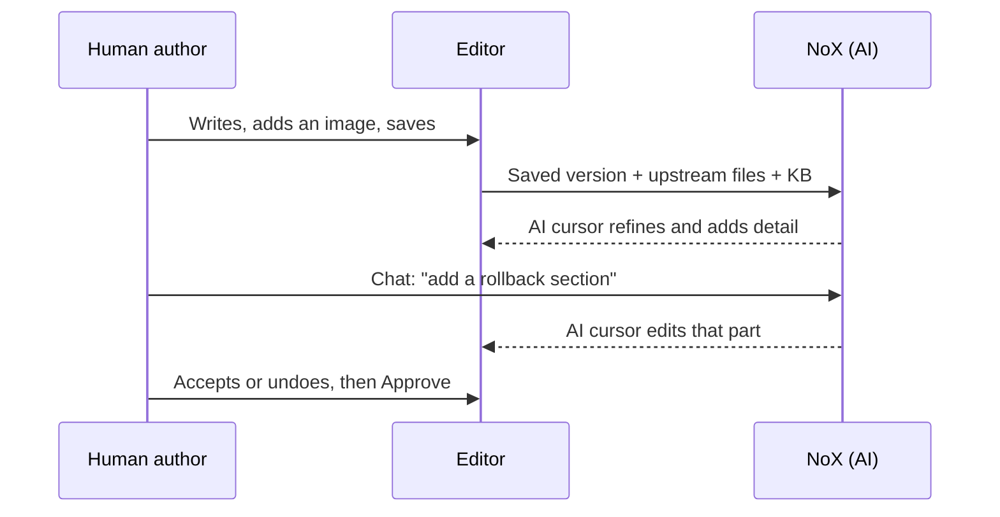

# NoX — Product Journeys (v2, real platform)

Sep 24, 2026 · @Someone

## What changed from v1

NoX is no longer a seeded demo. It is a real platform with two halves: a knowledge-base engine that onboards applications, connects their knowledge sources and compiles an interconnected code wiki, and on top of it multi-role, spec-driven work on tasks.

| Area | v1 plan (hackathon demo) | v2 (this doc) |
| --- | --- | --- |
| Backend | Firestore + seeded data | FastAPI + Postgres + Celery/Redis |
| Knowledge base | Eight hard-coded apps from the landing page | Real apps onboarded from GitHub, Confluence, Jira, Notion, Slack, uploads, compiled into knowledge-base repos |
| Sign-in | Firebase, then pick any role | Firebase (Google), then a free role picker to experience any seat |
| Roles | Free role picker, "demo mode" | Free role picker (large planet per role), server enforces the picked role's limits |
| Tasks | Seeded requests NOX-104… | Real tasks, created at any stage by any role, linked to new or existing Jira tickets |
| Spec | One artifact per stage, handed off | One Markdown file per role, written by one human + NoX's AI cursor, saved to the app's KB Git repo and the database |
| Integrations | Badges and stubs | Real: keys in `.env` |

**What the knowledge-base engine does**

- Firebase Google sign-in on the web app (`apps/web/lib/firebase.ts`).
- An org tree with unlimited nesting (`orgs.parent_org_id`) and apps under each org (`knowledge_bases`).
- Source connectors: GitHub, Confluence, Jira, Notion, Slack, file upload (`connectors/`).
- Flow A (Ingestor → Compiler → GitOps PR), Flow B (Gatekeeper keeps the KB in sync on push), Flow C (org rollup).
- The cross-app contract mesh (`org_interface_contracts`) and `[[kb:app/page]]` cross-KB wikilinks.
- KB chat, constraint guard, digest, lint and skill-export endpoints, plus the `nox` CLI skill for coding agents.
- Space-themed KB statuses: In the Void → Scanning Nebula → Compiling Stars → Awaiting Launch → In Orbit.

**What Missions adds on top**

- Real users, memberships and roles, checked on every API route.
- Tasks, specs, co-authoring, approvals and the reverse verification loop.
- Writing to Jira (create and link tickets), not only reading it.
- The NoX visual layer: the landing page's planetary design system carried into the app.

## The two halves of NoX

NoX has two workspaces, one on top of the other. **Atlas** builds the knowledge base, and **Missions** use it. Every spec, brief and verification in Missions is grounded in what Atlas knows.



|  | Atlas | Missions |
| --- | --- | --- |
| Purpose | Keep a live, interconnected map of every application | Take a change from idea to verified code on one shared spec |
| Main objects | Org, Application, Source, Knowledge base, Contract | Mission, Spec file (one per role), Approval, Jira link |
| Who uses it | Developers, Engineering leads, Product owners | Everyone, including Business users |
| Built on | The knowledge-base engine (Flows A, B, C) | Spec files, roles, approvals, Jira |
| Space language | Orbits, planets, KB statuses ("In Orbit") | Missions, launches, trajectories |

Naming note: "Missions" is a working name for the tasks area. It keeps the planetary theme without clashing with Jira's "issues".

## Sign-in and choosing a role

Every user signs in with Firebase (Google), then picks any of the four roles on a free role picker. The picker says plainly that this is a way to experience the platform quickly, not a real permission grant. The backend, knowledge bases and integrations behind each role are all real.

1. **Landing page → "Enter NoX"** → `/login` (Firebase Google popup).
2. **The backend verifies the Firebase ID token** on every API call and creates a `users` row the first time it sees a uid.
3. **Role picker (`/choose-role`)**
   - Heading: "Choose a role to experience NoX"
   - Sub-line: "You're picking a role only to try the platform from that seat. You can switch any time from the top bar."
   - Four **large planet icons** in a row (2 × 2 on mobile), each in its role colour. Under each: the role name, then one or two lines on what that role can do.

| Planet | Role | One-to-two line description under the icon |
| --- | --- | --- |
| Gold | Business user | Ask for a change in one plain sentence. Confirm at the end that what shipped is what you meant. |
| Violet | Product owner | Turn a request into a product spec: goals, acceptance criteria, edge cases and the metric. Configure applications and knowledge bases. |
| Teal | Engineering lead | Decide which applications change and what must not break. Owns the org hierarchy and the atlas. |
| Blue | Developer | Onboard applications, generate code wikis, and build missions with your own coding agent via `/nox`. |

4. **After picking:** the planet grows to fill the screen and the role's Mission control loads. The choice is saved as `users.last_role`, and returning users see "Continue as Developer →" above the picker.
5. **Switching:** the role chip in the top bar reopens the picker. The server treats the chosen role as the acting role for that session and checks the access matrix against it, so each role still gets its own real view and limits.
6. **First-run, any role that can configure (Developer, PO, Eng lead):** if no org exists yet, Mission control opens the "Chart your first organization" wizard (see Journey A).

## Journey A — Atlas: onboard, connect, generate

Developers and Product owners configure the atlas. Engineering leads own it. Business users never see this area. It runs on the engine's Flow A, B and C, with a NoX UI and real permissions.

**A1. Model the enterprise hierarchy**

The hierarchy mirrors a big enterprise: organization → division → team → application. The engine supports this through nested orgs (`parent_org_id`), so any depth works.



- **Create org:** name, slug, optional GitHub org, parent org. Creator becomes Org admin.
- **Invite members** by email, with a role scoped to an org node. The role flows down to everything beneath it unless overridden.
- The **Atlas view** draws this tree as nested orbits: orgs are systems, apps are planets. It reuses the landing page's orbital diagram.

**A2. Onboard an application**

| Step | User does | NoX does |
| --- | --- | --- |
| 1. Basics | Name, parent team, tier (core / service / edge), owners | Creates the app (`knowledge_bases` row, status In the Void) |
| 2. Sources | Adds one or more: GitHub repo, Confluence space/page, Jira project, Notion page, Slack channel, file upload | Validates each URL and credential live and shows a green or red check per source |
| 3. Settings | AI mode (remote / local / hybrid), sync mode (webhook / polling), target KB repo name | Suggests `kb-<app>` in the org's GitHub |
| 4. Generate | Clicks **Launch** | Queues Flow A |

**A3. Watch the knowledge base get built**

The live pipeline streams over SSE (`/api/v1/kb/{id}/stream`) and shows as a trajectory:

In the Void → Scanning Nebula (ingest) → Compiling Stars (compile pages) → Awaiting Launch (PR open) → In Orbit (merged)

- An event feed shows each source read, each page compiled, lint results and contracts found.
- At **Awaiting Launch**, the user reviews the KB PR on GitHub (link shown) or in NoX's page preview. Merging makes it **In Orbit**.
- Errors show on the failing step, with **Retry step** and **Restart** (existing endpoints).

**A4. Explore and maintain the code wiki**

- **Explore:** the tree of `index.md`, `summaries/`, `concepts/`, `entities/`, `decisions/`, rendered with working `[[wikilinks]]` and `[[kb:other-app/...]]` cross-app links.
- **Map:** the contract mesh across apps (endpoints, events, shared models from `org_interface_contracts`), drawn as orbital links.
- **Ask:** chat grounded in the KB (existing `/chat`).
- **Add source** later, **Sync now**, **Check updates**, **Lint**, **Digest** (the compact brief for agents), **Export skill**.
- **Continuous sync (Flow B):** on each push, the Gatekeeper decides whether the change matters. If it does, a patch PR updates the KB. The app's page shows "Last synced 4 min ago" and any pending KB PRs.
- **Org rollup (Flow C):** once 2+ apps in an org are In Orbit, an org-level KB is generated and rolls up the tree.

**A5. Connectors (settings)**

In v2, credentials are configured once per org in **Settings → Connectors**. For the hackathon they come from `.env`. Each connector shows status, last check and the scopes it has. See the Integrations doc for detail.

## Journey B — Missions: tasks from any step

A mission is one piece of work with one shared spec. Anyone can start one at the stage that fits them. A Business user starts at Intent, a Developer can start at Build. Every mission can be linked to an existing Jira ticket or create a new one.

**B1. Two ways a mission reaches you**

| Way in | Where it appears | Example |
| --- | --- | --- |
| Assigned to you | Mission control → "Waiting on you", plus an email/Slack ping if enabled | PO finishes the Definition section and hands it to the Engineering lead |
| You create it | **+ New mission** from anywhere (top bar, app page, KB page, Jira import) | Developer spots a bug while reading the Refunds KB and starts a mission right there |

**B2. Creating a mission: start from any role**

1. **What's it about?** One sentence or prompt (required) + application(s). NoX pre-selects apps by matching the prompt against the atlas, and the user confirms.
2. **NoX drafts the upstream spec files.** Any role that isn't first in the chain gets AI-written files for the roles before it, grounded in the prompt + knowledge base:

| Created by | AI drafts | Created by the user | Left for later |
| --- | --- | --- | --- |
| Business user | — | Business requirement | Product, Engineering, Developer |
| Product owner | Business requirement | Product spec | Engineering, Developer |
| Engineering lead | Business requirement, Product spec | Engineering design | Developer |
| Developer | Business requirement, Product spec (+ Engineering design) | Developer build spec | — |

3. **The proceed prompt.** Because the upstream files were written by AI and no human in those roles has approved them, NoX asks before going further:

> **No one has approved the business and product requirements yet.** NoX drafted them from your prompt and the knowledge base. Do you want to proceed anyway? · \[Review drafts first\] · \[Proceed\]

- **Proceed:** the mission continues at the creator's stage. The upstream files are marked **AI-drafted, unapproved** in their tab and on the Jira ticket. Business user and Product owner seats see a "Confirm this is what you meant" item in their queue. Confirming is optional and never blocks the Developer.
- **Review drafts first:** opens the Business requirement tab read-only, so the creator can read it and ask NoX, via chat, to change it before proceeding.

4. **Link to Jira:** *Link existing* (search by key or JQL, for example `PAY-412`) · *Create new* (project + issue type; summary and description come from the spec files) · *Later*.
5. **Who's in it:** assign people to the remaining roles' files, or leave them for anyone who takes that role.

**B3. Jira linking, in detail**

- **Link existing:** NoX pulls the ticket's summary, description, status, assignee and comments into the mission's context (the same content the Jira connector ingests), and shows the key as a chip.
- **Create new:** NoX creates the issue via the Jira REST API with a summary, a description rendered from the spec, labels `nox`, and a link back to the mission.
- **Keep in sync (both directions):**
  - NoX → Jira: stage changes post a comment and update status via a configurable transition map (for example Build → "In Progress", Done → "Done"). Approved spec files are posted as comments with a link to the file in the KB repo.
  - Jira → NoX: Jira webhook on status/assignee/comment updates the mission timeline.
- **One mission ↔ one primary ticket.** A mission may link extra tickets (sub-tasks created from the Build task list).
- **Import from Jira:** paste a key and NoX creates a mission from it, starting at the stage the ticket suggests.

**B4. Working a mission**

The mission page is a set of tabs, one spec file per role (next section). The right rail shows: Jira chip + status, apps touched (atlas links), who holds each role's file, the timeline, and GitHub PRs linked to it (from branch name or PR body `NOX-123`).

**B5. Build with `/nox` and verify**

- **Build:** in any coding assistant (Google Antigravity, Cursor, Codex, Copilot, Claude Code), the developer types **`/nox NOX-123`**. The NoX skill + CLI fetches all four spec files and the relevant KB pages, then drives the full SDLC in that agent: plan → implement → tests → PR that references `NOX-123`. NoX runs a guardrail check of the PR diff against the KB and comments on the PR.
- **Mark complete:** when the work is done, the Developer clicks **Mark as completed** on the mission. This starts the manual reverse checks.
- **Verify (reverse, manual):** every spec file ends with a **Verification checklist** that its author wrote. After Mark as completed, the checklists light up one at a time, back up the chain. Each person ticks their own list from their own point of view, then clicks **Verified**:
  1. Developer: `04-developer.md` checklist (code, tests, contracts untouched)
  2. Engineering lead: `03-engineering.md` checklist (scope, contracts, guardrails)
  3. Product owner: `02-product.md` checklist (acceptance criteria, edge cases, metric)
  4. Business user: `01-business.md` checklist ("is the original sentence now true?")
- Any unticked item can be flagged **Not met**, with a note. That sends the mission back to the stage that owns the item.
- **Close:** when the Business user verifies, the mission is Done, the Jira ticket transitions to Done, and Flow B updates the KB from the merged code.

## Spec files: one per role, co-written with NoX

Each mission has four spec files, one per role, not one shared document with sections. Each file is a detailed Markdown document written by exactly one human, working together with NoX's AI. The four files together are the mission's specification.

**The four files**

| Tab / file | Human author | What it holds (detailed) | Grounded in |
| --- | --- | --- | --- |
| `01-business.md` · Business requirement | Business user | Original sentence (never edited after approval), problem, who is affected, what should change, what "done" looks like, examples, screenshots | Prompt + atlas app match |
| `02-product.md` · Product spec | Product owner | Goal, user stories, acceptance criteria, edge cases ("from the map"), out of scope, success metric, priority, mockups | Business file + atlas behaviour |
| `03-engineering.md` · Engineering design | Engineering lead | Apps changing, approach, contracts (unchanged / additive / breaking), must-not-break, architecture/guardrails/standards, test strategy, rollout and rollback, risks, diagrams | Product file + contract mesh |
| `04-developer.md` · Build spec | Developer | Files and services touched, reuse, task list, test plan, rollout, linked PRs | Engineering file + KB pages + code |

**NoX writes each file for its reader.** Each role has a persona (`apps/api/nox_api/missions/personas.py`): who reads the file, what they look for, the words they use and the words they don't. When a change barely touches a role (a refactor started from the Developer seat, seen by the Business user), NoX writes that file as a light touch: short sections in plain words and a checklist of a few "still works as usual" checks.

**Every file ends with a Verification checklist.** It's written by the file's author (with NoX's help) while writing the spec, and says what that role will check before signing off. It stays greyed out until the Developer marks the mission completed. Then it's highlighted for its owner to tick. Ticks, notes and who verified are saved back into the same file and the database, so there is no separate verification file.

**Tabs and locking**

- The mission page shows the four files as tabs. The acting role's own tab is editable. Every other tab is **locked**: fully visible and readable, never editable by that role.
- A locked tab shows who wrote it, when it was approved, and whether it's **AI-drafted, unapproved** (see B2).
- Only one human ever edits a file, so there is no multi-person editing or merge conflict to handle.

**The editor: human + NoX**



- **Manual editing:** a rich Markdown editor with headings, lists, checklists, tables, code blocks, image upload and paste, and links to KB pages (`[[kb:app/page]]`).
- **NoX's cursor after save:** when the author saves, a labelled **NoX** cursor appears and visibly types into the same file. It refines wording, fills gaps (missing edge cases, contracts, tests) and adds detail from the knowledge base. A banner says "NoX is refining your spec…". NoX's additions are tinted and can be accepted or undone per block. The author stays in control.
- **Chat panel (corner):** a small, collapsible chat in the bottom-right. The author types what they want ("add a section on partial refunds", "rewrite the ACs as Given/When/Then"), and NoX's cursor makes the edit in the file while the author watches. The chat also answers questions about the KB ("which services read `refund.completed`?").
- **Approve:** freezes the file version. The next role is notified, and the Jira ticket gets a comment.

**Where files are saved (both, every approve and every save)**

1. **Git:** committed to the application's knowledge base repo (the `kb-<app>` repo NoX created when onboarding), under one folder per mission:

```
kb-order-matching-engine/
  missions/
    NOX-123-idempotent-order-ingest/
      01-business.md
      02-product.md
      03-engineering.md
      04-developer.md
      assets/
```

Drafts are committed to a `nox/NOX-123` branch. Approval merges that file to `main`. Each file carries front matter: `mission`, `role`, `author`, `status`, `approved_at`, `version`, `ai_drafted`.

2. **Database:** the same Markdown + front matter is stored in Postgres (`spec_files`, `spec_file_versions`), so the UI loads instantly and can search across missions without reading Git.

If a mission touches several applications, the files live in the primary app's KB repo, and the other apps' repos get a short `missions/NOX-123.md` pointer.

**Upstream changes ripple.** If an upstream file is re-approved as v2, NoX diffs it and flags the affected parts of downstream files **stale**. It notifies their authors and never edits their files silently.

## Per-role journeys

The four roles from the landing page stay. What changes is that each one now works on real apps, real KBs and real tickets.

**Developer**

1. Picks the Developer planet and lands on Mission control, with **Missions** and **Atlas** side by side.
2. **Atlas work:** onboards an app under their team, connects GitHub + Confluence + Jira, launches generation, reviews and merges the KB PR, fixes a failing source, pins a human correction on a KB page.
3. **Mission work, assigned:** opens a mission waiting on them. Reads the Business, Product and Engineering tabs (locked), then writes `04-developer.md` with NoX's cursor and the chat panel.
4. **Mission work, self-started:** "+ New mission" → types a prompt → NoX drafts the Business requirement and Product spec → prompt: "No one has approved these yet. Proceed?" → **Proceed** → creates or links the Jira ticket → writes the build spec.
5. **Build:** in their coding assistant, types **`/nox NOX-123`**. The agent loads all spec files + KB context and runs plan → code → tests → PR.
6. **Verify:** after merge, ticks "code vs build spec" with NoX's pre-filled evidence.

**Product owner**

1. Mission control: missions waiting on Definition, missions to verify, priority board.
2. **Atlas access:** can onboard apps and connect sources (same as Developer). Can't change org structure or connector credentials.
3. **Starts missions** at Definition, often from an existing Jira epic/story ("Link existing").
4. **Writes Definition** with NoX: ACs, edge cases from the map, metric. Approves, and the Eng lead is notified.
5. **Verifies** ACs in reverse.

**Engineering lead**

1. Mission control: Design queue, blast-radius view across open missions, atlas health (sync failures, stale KBs, open KB PRs).
2. **Owns the Atlas:** org hierarchy, members and roles, connectors, AI mode, guardrails/ADRs.
3. **Writes Design** on the impact map: confirms apps, classifies contracts, acknowledges guardrails.
4. **Verifies** scope vs design in reverse.

**Business user**

1. Mission control is plain-language only: "Ask for a change", "Needs your confirmation", "Your requests".
2. **No Atlas configuration.** Sees apps only as friendly summaries inside a mission.
3. **Starts missions** with one sentence. NoX drafts the Intent checklist, the user edits and confirms. A Jira ticket can be created automatically in the team's intake project.
4. **Confirms inferred intent** when a mission was started downstream ("Is this what the business wants?").
5. **Final verification:** "Is this now true?" against their own sentence.

## Access matrix

Roles are picked freely on the role picker. The picked role is the acting role for the session, and the server checks every API call against this matrix for that role, so each seat experiences its real limits.

| Capability | Business user | Product owner | Engineering lead | Developer |
| --- | --- | --- | --- | --- |
| See Atlas (config area) | No | Yes | Yes | Yes |
| Create / move orgs, teams | No | No | Yes | No |
| Invite members to an org | No | No | Yes (org admin) | No |
| Onboard an application | No | Yes | Yes | Yes |
| Add / remove sources on an app | No | Yes | Yes | Yes |
| Manage connector credentials | No | No | Yes | No |
| Launch / retry KB generation | No | Yes | Yes | Yes |
| Merge KB PR (on GitHub) | — | Per GitHub permissions | Per GitHub permissions | Per GitHub permissions |
| Read KB pages / chat with KB | Inside a mission only | Yes | Yes | Yes |
| Pin a human correction on a KB page | No | Yes | Yes | Yes |
| Create a mission | Yes (writes the first file) | Yes (any stage) | Yes (any stage) | Yes (any stage) |
| Edit spec file (others' tabs are locked, read-only) | 01-business.md | 02-product.md | 03-engineering.md | 04-developer.md |
| Comment / suggest on any section | Yes | Yes | Yes | Yes |
| Link / create Jira ticket | Create in intake project | Yes | Yes | Yes |
| Verify step (reverse) | Final | ACs | Scope | Code |
| Send a mission back | During own verify | Yes | Yes | Yes |

## Decisions (journey)

**Decided (24 Sep)**

- [x] **J1. Roles:** free role picker with a large planet per role and a one-to-two line description, framed as "experience the platform".
- [x] **J2. Downstream starts:** AI drafts the upstream files. The creator sees "No one has approved these yet. Proceed?" and may proceed.
- [x] **J3. Spec storage:** one detailed Markdown file per role, saved to the app's KB Git repo under `missions/NOX-123-*/` and to the database.
- [x] **J4. Co-authoring:** one human per file plus NoX (AI cursor after save + corner chat). Other roles' tabs are visible but locked.
- [x] **J5. Build:** `/nox NOX-123` skill + CLI in any coding assistant runs the SDLC.

**Still open**

- [x] **J6. Reverse verification:** manual. The Developer marks the mission completed, then each role ticks the checklist at the bottom of their own file, in reverse order.
- [ ] **J7. Business user and Jira:** create a ticket automatically when a Business user starts a mission, or only once a PO picks it up? *(default: automatically, in `APEX`)*
- [ ] **J8. Names:** keep "Atlas" and "Missions" as the two areas? *(default: yes)*
- [ ] **J9. Multi-app missions:** files in the primary app's KB repo with pointers in the others *(default)*, or in the org-level KB repo?
