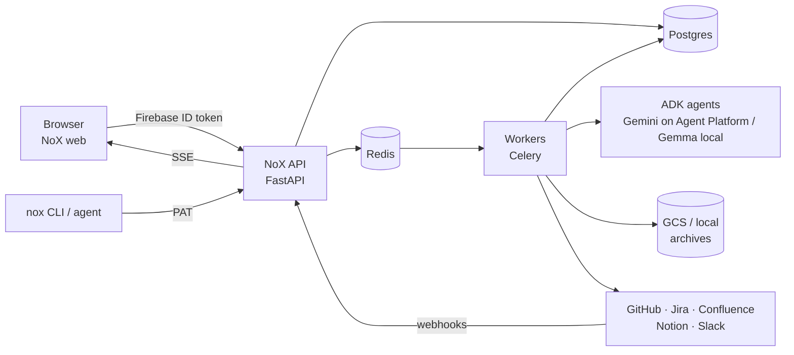
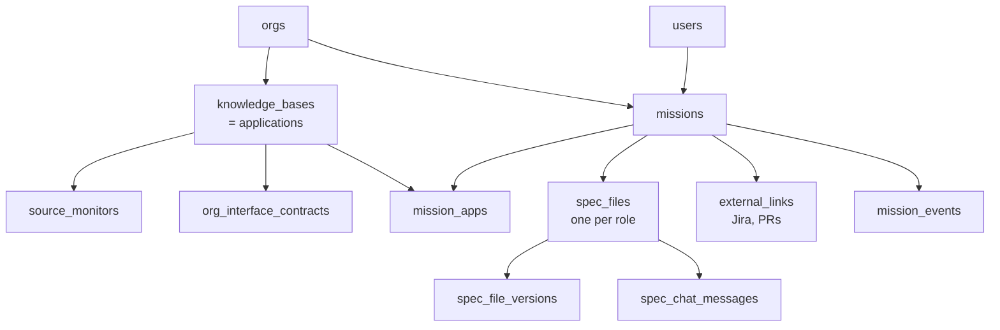
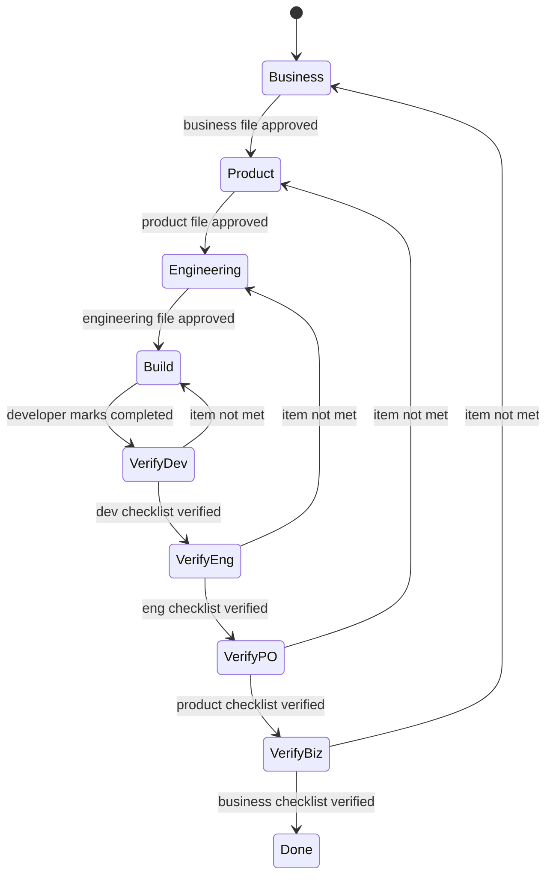

# NoX — Architecture & Tech Stack

Sep 24, 2026 · @Someone

NoX is a FastAPI + Celery + Postgres knowledge-base engine with users, roles, missions and shared specs on top, behind a Next.js web app. This doc covers how the pieces fit.

## Building blocks

| Piece | Where | Role |
| --- | --- | --- |
| Ingestor, Compiler, Gatekeeper, Rollup agents | `nox_api/agents/` | Build and sync knowledge bases (anchors, linter, digest alongside) |
| Pipeline runner + dispatcher (Celery or in-process) | `agents/runner.py`, `workers/` | Run Flow A / B / C as jobs |
| Source connectors: GitHub, Confluence, Jira, Notion, Slack, upload | `nox_api/connectors/` | Read side, with Jira *write* in `integrations/` |
| GitOps (GitHub App / PAT, repo + PR) | `services/gitops.py` | KB repos, KB PRs, spec commits |
| Contract mesh + cross-KB links | `agents/contracts.py`, `org_interface_contracts` | Feeds Design impact maps |
| KB routes: tree, file, chat, guard, digest, lint, export-skill | `routers/kb.py` | Behind auth |
| Org tree routes | `routers/orgs.py` | Orgs, members, roles |
| Webhooks: GitHub push/PR, Jira, Slack, Confluence | `routers/webhooks.py` | Sync on push, PR↔mission linking |
| SSE event stream | `services/sse.py` | Pipeline and mission live updates |
| Auth | `core/auth.py` | Firebase ID-token verification, access matrix |
| Schema | `alembic/` | Alembic migrations |
| Web app (Next 15, React 19, xyflow) | `apps/web` | Landing, Atlas, Missions |
| `nox` CLI | `packages/nox-cli/` | `/nox` for coding agents, mission context |
| Missions, specs, roles, Jira write | `missions/`, `routers/missions.py` | The spec-driven half |

## System architecture

One web app, one API, one worker pool, one database. The API is the only thing that talks to Postgres and the outside tools. The web app talks only to the API.



| Component | Responsibility | Notes |
| --- | --- | --- |
| NoX web | Landing, login, Atlas, Missions, spec editor | New |
| NoX API | Auth, RBAC, REST, webhooks, SSE | Engine routers + mission routers |
| Workers | KB pipelines (Flow A/B/C), spec drafting, Jira sync, verification evidence | Celery tasks |
| Postgres | Orgs, apps/KBs, sources, contracts, users, roles, missions, specs, events | Engine tables + mission tables |
| Redis | Celery broker, SSE pub/sub, presence | |
| Storage | Raw ingested content, checkpoints, uploads, spec attachments | GCS or local disk |
| GitHub | Source code, KB repos (`kb-*`), PRs, spec commits | GitHub App |
| Jira | Read (ingest) + write (create/link/transition/comment) | REST v3 |

**Code layout:** one monorepo.

```
nox/                         (the Project NoX repo)
  apps/web/                  Next.js 15 — landing + app
  apps/api/                  FastAPI — knowledge-base engine + mission routers
    nox_api/agents/          ingestor, compiler, gatekeeper, rollup, guard, linter, digest, anchors, contracts, llm
    nox_api/connectors/      github, confluence, jira (read + write), notion, slack, upload
    nox_api/routers/         orgs, apps, kb, missions, files, jira, webhooks, me, cli
    nox_api/workers/         celery tasks + dispatcher
    alembic/
  packages/nox-cli/          `nox` CLI + /nox skill for coding agents
  scripts/                   seed-demo, deploy, setup
  docs/
  docker-compose.yml, Makefile, .env.example
```

## Tech stack

| Layer | Choice | Note |
| --- | --- | --- |
| Web framework | Next.js 15 (App Router), React 19, TypeScript |  |
| Styling | Tailwind 3 + NoX tokens | Planetary design system |
| Motion / 3D | GSAP 3, three.js / react-three-fiber | Planets, orbits, co-author cursors |
| Graphs | `@xyflow/react` | Org tree, contract mesh, impact map |
| Spec editor | TipTap (ProseMirror) with Markdown import/export, image upload, AI-cursor decorations | Block-level authorship marks |
| Markdown render | `react-markdown` + `remark-gfm` + wikilink plugin | KB explorer |
| Auth (client) | Firebase Auth, Google |  |
| API | FastAPI, Python 3.12, Pydantic v2 |  |
| ORM / migrations | SQLAlchemy 2 async + Alembic |  |
| Auth (server) | `firebase-admin` ID-token verification |  |
| Jobs | Celery + Redis, beat for polling | `WORKER_MODE=in_process` for simple demos |
| Real-time | SSE + Redis pub/sub | Presence via SSE heartbeats |
| Database | PostgreSQL 16 |  |
| Storage | GCS, local-disk fallback |  |
| LLM | Google ADK agents on Gemini (Gemini Enterprise Agent Platform), Gemma via Ollama for NoX Local; `gemini-embedding-2` + pgvector for search | See AI layer |
| Git | PyGitHub, GitHub App |  |
| Jira / Confluence | Atlassian REST v3 via `httpx` |  |
| CLI | `nox` (Node, no dependencies) |  |
| Infra | Docker Compose locally; Cloud Run + Cloud SQL + Memorystore + GCS |  |

## Data model

The engine has six tables. NoX adds tables for identity and access, missions and specs, and integrations. Every new table carries `org_id` so authorization and queries stay scoped.



**Engine tables**: `orgs` (tree via `parent_org_id`), `knowledge_bases` (one per application; add `tier`, `owner_team`), `kb_events`, `source_monitors`, `org_kbs`, `org_interface_contracts`.

**New tables**

| Table | Key columns | Purpose |
| --- | --- | --- |
| `users` | `id`, `firebase_uid`, `email`, `name`, `photo_url`, `last_role`, `created_at` | One row per signed-in person; `last_role` from the role picker |
| `memberships` | `user_id`, `org_id`, `joined_at` | Which orgs a user can see (roles are picked, not granted) |
| `missions` | `id`, `key` (`NOX-123`), `org_id`, `primary_kb_id`, `title`, `prompt`, `type`, `priority`, `stage`, `direction`, `created_by`, `created_as_role`, `proceeded_without_approval` | The unit of work |
| `mission_apps` | `mission_id`, `kb_id` | Apps a mission touches |
| `spec_files` | `id`, `mission_id`, `role` (business \| product \| engineering \| developer \| verification), `author_id`, `status` (ai\_drafted \| draft \| approved \| stale), `current_version_id`, `git_path`, `git_branch` | One Markdown file per role |
| `spec_file_versions` | `id`, `spec_file_id`, `version`, `markdown`, `front_matter` (JSONB), `ai_spans` (JSONB: ranges NoX wrote), `git_commit_sha`, `saved_by`, `approved_at` | Every save and approval; mirrors Git |
| `spec_chat_messages` | `spec_file_id`, `user_id` \| `nox`, `body`, `applied_version_id` | Corner chat per file |
| `spec_assets` | `spec_file_id`, `path`, `storage_url`, `mime` | Images added in the editor, also committed under `assets/` |
| `verification_checks` | `mission_id`, `role`, `item_ref`, `result`, `evidence` (JSONB), `checked_by` | Reverse loop |
| `external_links` | `mission_id`, `system` (jira \| github\_pr), `external_id` (`PAY-412`), `url`, `primary`, `sync_state` | Jira tickets and PRs |
| `mission_events` | `mission_id`, `actor_id`, `acting_role`, `type`, `payload`, `created_at` | Timeline and audit |
| `api_tokens` | `user_id`, `hash`, `last_used_at` | For the `nox` CLI / `/nox` skill |

## API surface

All routes move under `/api/v1` and require a verified user, except webhooks (HMAC or signature) and the public KB discovery routes the CLI uses.

**Existing (kept, now behind auth + RBAC)**

| Area | Routes |
| --- | --- |
| Orgs | `GET/POST /orgs`, `GET /orgs/{id}`, `GET /orgs/{id}/tree`, `POST /orgs/{id}/apps` |
| KB lifecycle | `GET /kb`, `GET /kb/{id}`, `POST /kb/{id}/sync`, `/check-updates`, `/restart`, `/retry`, `POST /kb/{id}/add-source` |
| KB content | `GET /kb/{id}/tree`, `/file`, `/digest`, `/lint`, `/export-skill`, `GET /kb/resolve` |
| KB AI | `POST /kb/{id}/chat`, `POST /kb/{id}/guard` |
| Live | `GET /kb/{id}/stream` (SSE) |
| Uploads | `GET /upload/presigned`, `POST /upload/file` |
| Webhooks | `POST /webhooks/github/push`, `/github/pr`, `/slack/events`, `/confluence` |

**New**

| Area | Routes |
| --- | --- |
| Me | `GET /me`, PUT /me/role (role picker), `POST /me/tokens` (CLI token) |
| Members | `GET/POST /orgs/{id}/members`, `DELETE /orgs/{id}/members/{userId}` |
| Missions | `GET /missions?stage=&app=&assignee=me`, `POST /missions` (prompt, apps) → AI drafts upstream files, POST /missions/{key}/proceed (confirm without approval), `GET/PATCH /missions/{key}` |
| Spec files | `GET /missions/{key}/``files, GET/PUT /missions/{key}/files/{role} (save → DB + Git commit), POST .../files/{role}/refine (NoX cursor pass), POST .../files/{role}/approve, POST .../files/{role}``/send-back` |
| Chat + assets | `GET/POST /missions/{key}/``files/{role}/chat (NoX applies edits), POST /missions/{key}/files/{role}/assets (image upload)` |
| Verification | `GET /missions/{key}/verification`, `POST /missions/{key}/verification/{role}` |
| Jira | `GET /integrations/jira/search?q=`, `POST /missions/{key}/jira/link`, `POST /missions/{key}/jira/create`, `POST /missions/import/jira` |
| Live | `GET /missions/{key}/stream` (SSE: edits, presence, events) |
| Webhooks | `POST /webhooks/jira` |
| CLI | `GET /cli/missions/{key}/context` (all spec files + KB digest + relevant pages), used by /nox NOX-123 |
| Connectors | `GET /integrations/status` (which keys are set, and whether they work) |

## Orchestration

Everything slow runs as a Celery task. The API only validates input, writes state, enqueues work and streams progress. Every task writes an event, and every event is published to Redis, so SSE clients update live.

**Tasks**

| Task | Trigger | Does | Exists? |
| --- | --- | --- | --- |
| `generation_pipeline` | App launched | Flow A: ingest → compile → lint → PR | Yes |
| `add_source_pipeline` | Source added | Ingest one source, patch KB | Yes |
| `gatekeeper_pipeline` | GitHub push webhook / poll | Flow B: classify diff → patch PR | Yes |
| `rollup_pipeline` | KB merged, 2+ apps in orbit | Flow C: org KB | Yes |
| `poll_sources` | Beat, every 5 min | Polling mode for sources | Yes |
| `refine_file` | Author saves a spec file | Builds context (saved file + upstream files + KB digest + relevant pages + contracts), streams NoX's edits as cursor ops into the editor | New |
| `draft_upstream_files` | Mission created by a downstream role | Writes AI-drafted business (and product/engineering) files; the UI then shows the proceed prompt | New |
| `mark_stale` | Section re-approved | Diffs versions, marks affected downstream blocks stale | New |
| `jira_sync_out` | Stage / approval change | Transition + comment on the linked issue, with retry | New |
| `jira_sync_in` | Jira webhook | Update mission timeline and assignee | New |
| `prefill_checklist (optional)` | Developer marks completed | `Attaches hints (linked PR diff, guard result) next to checklist items; humans still tick every item` | New |
| `spec_commit` | Every save (branch) and approve (merge) | Commits `missions/NOX-123-*/0N-role.md + assets to the app's KB repo on nox/NOX-123; merges the file to main on approve` | New |

Also new: `chat_edit` (corner-chat message → NoX edits the file via the same cursor stream as `refine_file`).

**Mission state machine (server-enforced)**



A mission started downstream enters at its start stage, and upstream sections are created with status `inferred`.

**Real-time**: one SSE channel per mission and per KB. Messages are `event`, `file.saved`, `file.approved` and `nox.cursor` (NoX's edit ops, streamed so the AI cursor visibly types). One human per file means no CRDT or multi-user editing server is needed.

## Auth and authorization

Firebase proves who the user is. The role they picked on the role picker decides what they can do in that session. Every request carries a Firebase ID token, and FastAPI verifies it with `firebase-admin`.

1. **Web:** Firebase Google popup → `getIdToken()` → `Authorization: Bearer <token>` on every call.
2. **`current_user` dependency:** verify the token, then upsert `users` by `firebase_uid`.
3. **Acting role:** `PUT /me/role` stores the picked role in `users.last_role`, and the web app also sends `X-Nox-Role`. The server accepts only one of the four roles and checks the access matrix against it, so a Business user session gets 403 on Atlas routes. It is a free choice by design (decision J1), not a security boundary.
4. **Org visibility:** `memberships` decides which orgs a user can see. The creator of an org is a member, and others join by invite.
5. **File locking:** `PUT /missions/{key}/files/{role}` is accepted only when the acting role equals `{role}`. Every other role gets read access only.
6. **CLI / `/nox` skill:** `nox login` opens the browser, the user approves, and a personal API token (hashed in `api_tokens`) is saved to `~/.nox/config`.
7. **Webhooks:** GitHub HMAC, Slack signing secret, Jira shared secret in the webhook URL.
8. **Hardening:** CORS is restricted to the web origin, and `WEBHOOK_SECRET` is required with no default.

## AI layer

Every AI call is a **Google ADK agent** (`google-adk`), in `apps/api/nox_api/ai/`. One switch, `NOX_AI_BACKEND`, decides
where all of them run: **Gemini on the Gemini Enterprise Agent Platform** (Vertex AI) with the Cloud Run service
account in production, the Gemini Developer API with a key for local development, or **Gemma through Ollama** for
NoX Local. Agents ask for a model tier, not a name: FAST (`NOX_MODEL_FAST`), DEFAULT (`GEMINI_MODEL`), DEEP
(`NOX_MODEL_DEEP`). A failed primary falls back to `GEMINI_BACKUP_MODEL` (ADK `FallbackModel`).

```
ai/
  config.py      backend + model tiers → ADK model objects; genai client for embeddings
  runtime.py     run(agent) and stream(agent) → step / delta / done events; ADK sessions (Postgres schema `adk`)
  telemetry.py   usage_scope(): calls, tokens, cached share, seconds per unit of work → logs + UI
  schemas.py     typed outputs (ArchitectureMap, GatekeeperDecision, PagePatch, RollupResult, CoverageDiff)
  structured.py  one-shot agents constrained to a schema
  tools/         knowledge.py (KB search/read, contract map, source grep/read, Jira) · spec.py (section edits)
  agents/        ask.py · cowriter.py · kb_builder.py
```

| Job | Agent | Tools | Output |
| --- | --- | --- | --- |
| Build a KB | Cartographer → page writers (parallel, `NOX_MAX_CONCURRENCY`) → reviewer | — (writers get the files the cartographer assigned) | `ArchitectureMap`, pages, typed contracts |
| Sync a KB | Gatekeeper (code anchors first, then FAST model) → patch compiler | — | `GatekeeperDecision`, `PagePatch` |
| Org rollup | Rollup (DEEP) | — | `RollupResult` |
| Ask an application | Ask | search_kb, read_kb_page, list_pages, find_interfaces, grep_source, read_source_file, get_jira_issue | Streamed answer + citations |
| Co-write a spec file (chat, refine on save) | Co-writer | the lookup tools + read_spec_file, replace_section, insert_section, append_to_section, add_open_question | Section edits, streamed reply |
| First drafts of spec files | Drafter | the lookup tools | Whole file |

**How the pieces behave**

- **Scope is set by NoX, never by the model.** Tools read which applications the caller may see, and which mission
  file is open, from session state filled from the caller's memberships before the agent runs.
- **Ask** streams over SSE (`POST /api/v1/kb/{id}/ask`): each lookup appears as a step, answer text streams token by
  token, every page the agent read becomes a citation. Conversations persist in ADK database sessions.
- **The co-writer edits section by section.** Each tool call edits one `##` section, is broadcast at once
  (`nox.edit.partial`) so the editor animates it, and can't remove or rename a heading the author wrote. The turn is
  saved as one version, so one undo reverts it. Only the chat reply streams as text.
- **KB builds.** The cartographer reads the whole snapshot once and returns the overview, components, interfaces
  and the page plan with the exact source files per page (one call where there used to be three). Writers share one
  identical prefix via `static_instruction` (implicit caching) and get only their own files; the reviewer rewrites
  only pages that fail the deterministic linter. Measured on market-data-gateway: 11 pages in 29 s from 12 calls and
  20k input tokens, against 16 pages in 252 s, 19 calls and 85k tokens for the classic pipeline
  (`scripts/bench_kb.py`). `NOX_KB_BUILDER=classic` keeps the old path.
- **Search** (`services/search.py`): pages split at `##` headings, embedded with `gemini-embedding-2` at 768
  dimensions into pgvector, fused with Postgres full-text by reciprocal rank fusion. Only changed sections are
  re-embedded; without pgvector or embeddings it runs on full-text alone. Used by Ask, the co-writer, drafting
  context and `nox search`.
- **NoX Local** (`python -m nox_api.local`, driven by `nox kb build | sync | push | watch`): the same KB builder,
  gatekeeper and patch compiler on Gemma via Ollama, reading the repo from disk. Only the Markdown pages are sent to
  NoX (`POST /api/v1/cli/kb/push`), which lints them, registers contracts, indexes them and opens the KB PR. The KB
  records `built_with = local:<model>` and the UI shows it.

**Grounding rules**

- Every NoX addition cites a source: a KB page (`[[kb:app/path]]`), an upstream file, a source file (`path:line`) or a
  Jira field. Unknowns become open questions.
- NoX never approves anything.

## Deployment and environments

Two paths: Docker Compose locally, and GCP (Cloud Run + Cloud SQL + Memorystore + GCS) via `scripts/deploy_gcp.sh`.

| Environment | How | Webhooks reach it via | Workers |
| --- | --- | --- | --- |
| Local dev | `docker compose up` (postgres, redis, ollama, api, worker, beat, web) or `make start-all` | ngrok / cloudflared (`WEBHOOK_BASE_URL`) or `SOURCE_MONITOR_MODE=polling` | Celery, or `WORKER_MODE=in_process` |
| Hackathon demo | Cloud Run: `nox-api`, `nox-web`; Cloud SQL Postgres; Memorystore Redis; GCS | Cloud Run public URL | A worker service on Cloud Run with min instances = 1 |
| Later | Same, plus Secret Manager for `connector_credentials` | — | Autoscaled |

**Demo-day safety**

- Pre-onboard 2–3 real repos (for example the Apex demo codebases) the day before, so their KBs are already In Orbit. Live generation during the demo only needs to reach "Scanning Nebula".
- A seed script creates the org tree, members and 3 missions at different stages (`make seed-demo`).
- Keep a Jira sandbox project (`NOXDEMO`) so creating tickets live is safe.

## Risks and known gaps

These are the gaps NoX had to close before real users arrive. The top three block multi-user use.

| Gap | Impact | Fix |
| --- | --- | --- |
| API routes need an auth dependency | Anyone with the URL could read or trigger any KB | `current_user` + `require()` on every router (done) |
| CORS must not allow `*` | Any site could call the API | Restricted to the web origin (done) |
| Secrets must not have defaults | Forgeable webhooks | Required, no default (done) |
| Schema needs migrations | New tables and columns can't be applied safely | Alembic baseline + migrations (done) |
| Atlassian Cloud needs base64(`email:token`) | A raw token fails | `ATLASSIAN_EMAIL` + `ATLASSIAN_BASE_URL`; encoded in code (done) |
| Jira must be writable | Can't create or transition tickets | `JiraClient` with write methods (done) |
| Credentials are global env vars | One Jira/GitHub per deployment | OK for the hackathon; `connector_credentials` later |
| Gemini quota on stage | Slow live generation on stage | Agent Platform quota instead of API-key limits; backup model fallback; pre-generate KBs |
| Test coverage | Regressions while extending | API tests for auth, missions, Jira, AI agents (fakes) |

## Decisions (architecture)

**Decided (24 Sep)**

- [x] **A3. AI provider:** Gemini, with Gemma via Ollama optional. No other provider.
- [x] **A4. Real-time:** SSE + streamed NoX cursor ops, with one human per file, so no CRDT is needed.

**Still open** (recommended option first)

- [x] **A1. Repo:** one NoX monorepo (web, API, CLI, demo data).
- [x] **A2. Front end:** NoX web app on Next 15/React 19, grown from the landing page.
- [ ] **A5. Hosting for the demo:** (a) GCP Cloud Run *(recommended: also gives the public URL Jira needs)* · (b) laptop + tunnel.
- [ ] **A6. Workers on demo day:** (a) Celery worker service *(recommended)* · (b) in-process mode.
