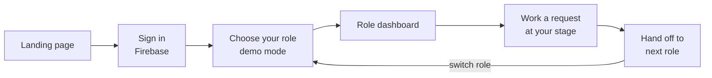
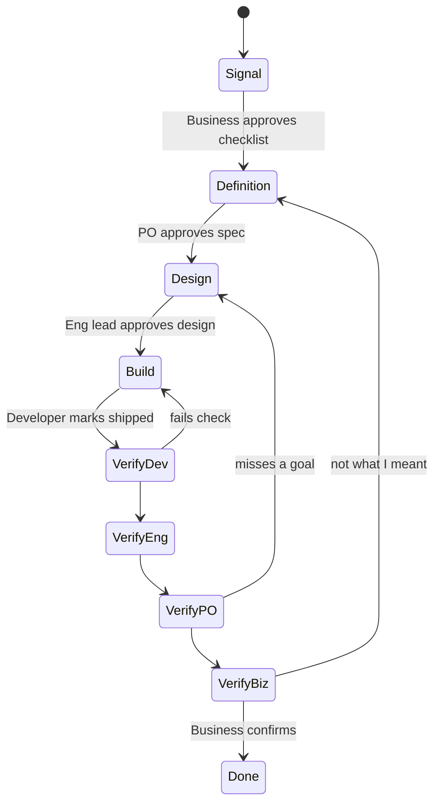
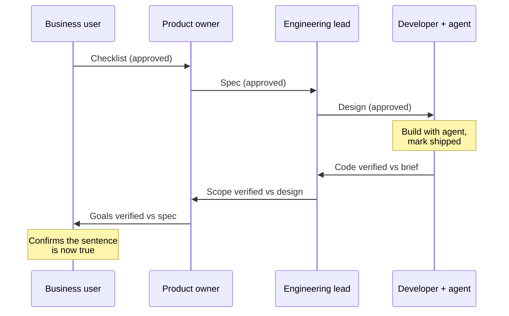

# NoX — Hackathon App Journey & Feature Spec

Sep 23, 2026 · @Someone

This doc is the full journey behind the landing page: sign in with Firebase, pick a role, then work a real change request from that role's dashboard. One tab per role follows this one, listing everything that role sees and can do.

## Overview

The hackathon build is a working proof of concept of NoX: a signed-in app where one person can play any of four roles and move a single change request through the whole loop. The loop runs from sentence, to spec, to design, to code, and then back through verification. Everything runs on seeded data about a fictional financial company, so a judge can finish the full loop in about five minutes.

**What the POC proves**

- One plain-language sentence can carry its original intent through four roles without being retyped.
- Each role gets a view built for their job, not a shared ticket screen with fields they ignore.
- The application map (the "atlas") is the shared context every role draws from.
- Verification runs in reverse and checks the result against the original sentence, not the ticket it became.

**What it is not**

- Not multi-tenant, and it does not ingest real repositories. The atlas is seeded from the eight applications already on the landing page.
- No real Jira, GitHub or Slack sync. The integration points appear as badges and stubs.
- Roles are picked freely rather than assigned. That is the "demo mode" the role picker tells the user about.

**The end-to-end path**



The user can switch roles at any time from the top bar, which takes them back to the role picker without signing out. That is how one person walks the whole chain in a demo.

**The four roles**

| Role | Planet | Stage they own | One line |
| --- | --- | --- | --- |
| Developer | Largest planet, centre | Build, then verify the code | Gets a grounded technical brief and a coding agent that already knows the estate. |
| Business user | Small planet | Signal, then final sign-off | Writes one sentence and confirms, in their own words, that it came true. |
| Product owner | Small planet | Definition, then acceptance | Turns the checklist into goals, acceptance criteria, edge cases and a metric. |
| Engineering lead | Small planet | Design, then scope review | Decides which applications change, what the contracts are and what must not break. |

The four roles match the lifecycle section of the landing page (Signal, Definition, Design, Build, Verify). The coding agent is not a separate role. It lives inside the Developer's workspace.

## Sign-in

Sign-in uses Firebase Authentication with Google and email/password. Both land the user on the role picker. The landing page's existing CTA ("Enter NoX" / "Request access") becomes the way into the app.

**Entry points**

| From | Goes to | Behaviour |
| --- | --- | --- |
| Landing nav, "Sign in" | `/login` | Standard sign-in. |
| Landing CTA section | `/login?next=/choose-role` | Same screen. After sign-in, goes straight to the role picker. |
| Any `/app/*` URL while signed out | `/login?next=<that URL>` | Returns to the page the user was trying to reach. |
| `/login` while already signed in | `/choose-role`, or the last dashboard | Skips the form. |

**The sign-in screen**

- Full-bleed starfield background, the same one used by the landing page (`globals.css`). The NoX mark sits at the top with a slow-orbiting ring behind it.
- One card in the centre: "Continue with Google" as the main button, then a divider, then email + password fields with "Sign in" and "Create account" links.
- A small line under the card: "Hackathon proof of concept. Your account is only used to save your demo progress."
- A "Back to the landing page" link in the top-left corner.

**States and errors**

| State | What the user sees |
| --- | --- |
| Loading (Firebase resolving the session) | The NoX mark pulses. The form is hidden, so it never flickers. |
| Wrong password / no such user | Inline under the field: "That email and password don't match." Firebase's error codes are never shown. |
| Google popup closed | Nothing. The user stays on the form. |
| Popup blocked | Falls back to `signInWithRedirect`. |
| Network error | A banner on the card: "Can't reach NoX right now. Check your connection and try again." |
| Sign-in succeeds | The card compresses into a small planet that drifts toward the centre, then the route changes to the role picker (about 600 ms, skipped under reduced motion). |

**First sign-in**

On a user's first sign-in, the app creates a `users/{uid}` document holding their display name, photo, `createdAt`, `lastRole: null` and `demoSeeded: false`. It then copies the seed workspace (see Build notes) so each judge has their own copy of the demo requests and can't overwrite anyone else's.

**Signing out**

The avatar menu in the top bar has "Switch role", "Reset demo data" and "Sign out". Signing out returns the user to the landing page.

## Choose your role

After sign-in, the user lands on `/choose-role`: a small solar system where each role is a planet. The Developer is the largest planet, at the centre. The other three are smaller planets orbiting it. Clicking a planet opens that role's dashboard.

**Copy on the screen**

- Eyebrow: "Demo mode"
- Heading: "Choose the role you want to play."
- Body: "This is a hackathon proof of concept. In a real team, your role comes from your organisation. Here, you can pick any of the four, see NoX from that seat, and switch whenever you like to follow one request all the way round."
- Footer hint: "New here? Start as the Business user. That's where every request begins."

**Layout**

| Element | Size (desktop) | Position | Label under it |
| --- | --- | --- | --- |
| Developer planet | 200 px | Centre, like the sun of the system | Developer · "Build it with an agent that knows the estate" |
| Business user planet | 96 px | Inner orbit, upper left | Business user · "Ask for a change in one sentence" |
| Product owner planet | 96 px | Inner orbit, upper right | Product owner · "Define what done means" |
| Engineering lead planet | 96 px | Inner orbit, bottom | Engineering lead · "Decide what changes and what must not break" |

Each planet reuses a hue from the landing page's colour set in `lib/content.ts`, so a role keeps one colour everywhere in the app: avatar ring, tab underline, handoff chips.

| Role | Hue | Planet look |
| --- | --- | --- |
| Developer | `#86B9EE` (blue) | Banded gas giant with one thin ring |
| Business user | `#E8C97A` (gold) | Warm, solid, small |
| Product owner | `#A897F0` (violet) | With a single moon |
| Engineering lead | `#5FCBD8` (teal) | With a wide ring |

**Behaviour**

- The three small planets orbit slowly (about 60 s per revolution). The motion pauses while any planet is hovered, and is off entirely under reduced motion.
- Hovering a planet brings it forward and dims the others, the same focus pattern the landing hero uses. A card slides in listing three things that role does in the demo.
- A badge on each planet shows how many requests are waiting for that role, for example "2 waiting". This guides the demo: the badge tells you which seat to take next.
- Clicking a planet makes it grow to fill the screen (about 700 ms), then the dashboard fades in. `users/{uid}.lastRole` is saved.
- On mobile, the planets stack as a vertical list with Developer first and larger. There's no orbit.
- Keyboard: planets are buttons in reading order (Developer, Business user, Product owner, Engineering lead). Enter opens the dashboard.

**Returning users**

If `lastRole` is set, the picker shows a line above the planets: "Continue as Product owner →". The whole system still appears, so switching stays one click.

## Dashboard shell

Every role uses the same frame: a left sidebar, a top bar and a main area. The names in the sidebar are the same for everyone. What changes by role is which items appear, what each list shows first, and which actions are allowed.

**Sidebar (the "orbit rail")**

| Item | Icon | Who sees it | What it opens |
| --- | --- | --- | --- |
| Mission control | Role's planet | All | The role's home: what's waiting, what's in flight, recent activity. |
| Requests | Comet | All | Features and tickets tracker: every request and where it sits in the loop. |
| Atlas | Constellation | All | Onboarded applications, their dependencies and owners. |
| Artifacts | Stacked orbits | All | Every document produced: checklists, specs, designs, briefs, verification reports. |
| Workspace | Terminal | Developer only | The coding agent session, grounded in the request and the atlas. |
| Activity | Signal waves | All | Timeline of handoffs, approvals and comments. |

**Top bar**

- Left: the NoX mark and the page name.
- Centre: search across requests, applications and artifacts (⌘K).
- Right: a role chip (planet + role name, in the role's colour) that opens "Switch role"; a notifications bell for handoffs addressed to this role; the avatar menu.
- A thin "Demo mode" ribbon above the top bar reminds the user they are playing a role. It stays visible so screenshots can't be mistaken for a live product.

**The planetary theme, applied**

- Background: the landing starfield at 30% opacity, so data stays readable.
- Status is drawn as position on an orbit. Each request card has a small arc with five dots (Signal, Definition, Design, Build, Verify), and a packet glowing at the current stage. It's the same motif as the landing lifecycle.
- Handoffs animate as a packet leaving one planet and arriving at the next, in the Activity feed and in the toast "Sent to Product owner".
- Applications in the Atlas are the landing page's orbiting bodies, drawn in their own hues on the three orbital shells.
- Fonts and tokens come from the landing page unchanged: Instrument Serif for headings, Manrope for UI text, IBM Plex Mono for code and IDs.
- Empty states use a lone planet with one line, for example "Nothing in your orbit. Requests handed to you will land here."

**Mission control (every role's home)**

1. **Waiting on you**: requests at this role's stage, oldest first, each with the previous role's frozen artifact as a chip.
2. **In flight**: requests this role has touched that are now with someone else, with their current stage on the orbit arc.
3. **Coming back to you**: requests in reverse (verification) that will need this role's sign-off.
4. **Primary action**: one large button whose label depends on the role (see each role's tab).

**Requests tracker (shared layout)**

- Default view is a board with five columns (Signal, Definition, Design, Build, Verify). A table view has the same data.
- Filters: My stage, Application, Priority, Type (feature / bug / change), Direction (forward / verifying).
- Each card shows: ID (`NOX-104`), title, the original sentence (truncated, in quotes), applications touched as coloured dots, the orbit arc, owner avatar and age.
- Opening a card opens the request detail page (see Core objects).

## Core objects

The app has four objects: a **request** (the thing that moves), its **artifacts** (one per stage, frozen once approved), **applications** (the atlas) and **events** (the activity trail). A "ticket" in the UI is simply a request at the Build stage, split into tasks.

**Request**

| Field | Type | Example | Set by |
| --- | --- | --- | --- |
| `id` | string | `NOX-104` | System |
| `sentence` | string, never edited | "Customers keep asking where their refund is. Can we show them it's on its way?" | Business user |
| `title` | string | Refund status visible to customers | NoX, editable by Product owner |
| `type` | feature \| bug \| change | feature | Business user |
| `priority` | P1–P4 | P2 | Product owner |
| `stage` | signal \| definition \| design \| build \| verify \| done | definition | System, on handoff |
| `direction` | forward \| reverse | forward | System |
| `verifyStep` | developer \| engineering \| product \| business | — | System, in reverse only |
| `apps` | app id\[\] | refunds, portal, notify, ledger | NoX from the atlas, confirmed by Engineering lead |
| `owners` | map of role → uid | — | Set as each role picks it up |
| `artifactIds` | map of stage → id | — | System |
| `createdAt` / `updatedAt` | timestamp | — | System |

**Request lifecycle**



Any reverse step can send the request back, with a reason, to the stage where the problem started. The reason is attached to the returned request as a red comment on the relevant artifact line.

**Artifact**

| Field | Notes |
| --- | --- |
| `kind` | `checklist`, `spec`, `design`, `brief`, `verification` |
| `stage`, `requestId`, `role` | Which stage and seat produced it. |
| `blocks[]` | The document body as ordered blocks: heading, paragraph, checklist item, image, code, callout. The same beat model the landing page's co-authoring animation uses. |
| `authorship` | Per block, `user` or `nox`, so the UI can tint what NoX drafted versus what the human wrote. |
| `status` | `draft` → `approved` (frozen, read-only) |
| `approvedBy`, `approvedAt` | Shown on the frozen card. |
| `parentArtifactId` | The previous stage's artifact this one was built from. Rendered as the chip on top. |

**Application (atlas entry)**

The atlas entries come straight from the landing page's `APPS` data: name, kind, tier (core / service / edge), hue, summary, freshness ("Synced 4 min ago"), owns, depends, breaks, contracts and guardrail. The app adds `ownerTeam`, `repoUrl` (a placeholder), `openRequests` and `onboardedAt`.

Seeded applications: Ledger Core, Identity, Refunds Service, Payments API, Risk Engine, Customer Portal, Notifications, Reporting.

**Event**

`{requestId, actorUid, role, type, at, payload}` where `type` is one of: `created`, `drafted`, `edited`, `approved`, `handed_off`, `returned`, `commented`, `verified`. The Activity page and each request's timeline read from this.

**Request detail page (shared by all roles)**

- Header: ID, title, and the original sentence in large serif quotes, always pinned at the top. Every role reads the same words.
- The orbit arc, showing all five stages with the current one lit, plus a reverse arc once shipped.
- Artifact stack: one card per stage. Earlier stages appear frozen and collapsed. The current stage is open, and editable if it's this role's turn.
- Right rail: applications touched (from the atlas), people on the request, and the timeline.
- Footer action bar: the role's action for this stage (Approve and hand off, Send back, Mark shipped, Verify).

## The handoff chain

A request moves forward through four seats, then comes back through the same four in reverse. At each stop, the role inherits the previous role's frozen artifact plus the atlas. It never works from a retyped summary.



**What each handoff carries**

| Handoff | Artifact passed | What NoX adds from the atlas | Receiver's first screen |
| --- | --- | --- | --- |
| Business → Product | Checklist: what should change, what "done" looks like | Which applications the sentence is really about, and similar past requests | Draft spec, pre-filled from the checklist |
| Product → Engineering | Spec: goal, acceptance criteria, edge cases, metric | Owners, dependencies, contracts and guardrails of each app touched | Draft design with an impact map |
| Engineering → Developer | Design: apps to change, contracts, what must not break | Code locations, existing components to reuse, tests to run | Technical brief + "Open in workspace" |
| Developer → Engineering (reverse) | Developer verification: diff vs brief | Contract check against the atlas | Scope checklist, pre-ticked where NoX could confirm |
| Engineering → Product (reverse) | Scope verification | — | Acceptance criteria as a checklist |
| Product → Business (reverse) | Product verification | — | Their own original sentence, with a yes / not quite |

**Rules**

- A role can only approve the stage it owns. Everything else is read-only for them, but they can still comment.
- Approving freezes the artifact, writes a `handed_off` event and moves the request to the next stage.
- "Send back" is available at every stage after Signal and during every reverse step. It needs a one-line reason, and the request returns to the stage chosen.
- The original sentence is never editable after Signal. If it's wrong, the Business user closes the request and starts a new one.
- In the demo, every seat is the same person. The owner of each stage is whichever uid acted in that role, so the timeline still reads like a team.

## Permissions

Everyone can see everything, because a shared view is the point. Only the role that owns a stage can write or approve at that stage. The table is the full matrix. Each role's tab explains the screens behind it.

| Capability | Business user | Product owner | Engineering lead | Developer |
| --- | --- | --- | --- | --- |
| Create a new request | Yes (the main way in) | Yes, on a user's behalf | Yes (tech debt / change) | Yes (bug) |
| Edit the original sentence | Before approval only | No | No | No |
| Approve checklist (Signal) | Yes | No | No | No |
| Write / approve spec (Definition) | No | Yes | No | No |
| Set priority | No | Yes | No | No |
| Write / approve design (Design) | No | No | Yes | No |
| Confirm applications touched | No | No | Yes | No |
| Open coding agent workspace | No | No | View only | Yes |
| Mark shipped | No | No | No | Yes |
| Verify step (reverse) | Final sign-off | Goals vs spec | Scope vs design | Code vs brief |
| Send back with a reason | During own verify step | Yes | Yes | Yes |
| Comment on any artifact | Yes | Yes | Yes | Yes |
| View atlas | Plain-language summary view | Summary + owners | Full, including contracts and guardrails | Full + code locations |
| Onboard an application | No | No | Yes | No |
| Reset demo data | Yes | Yes | Yes | Yes |

In the POC, Firestore security rules check only that the user is signed in and owns the workspace. The role gating above happens in the UI, because a real role doesn't exist yet. The Build notes cover this.

## Demo script

The demo takes five minutes and follows one fresh request all the way round. Three seeded requests sit at other stages so each dashboard looks lived-in.

| Time | Seat | Do this | Point to make |
| --- | --- | --- | --- |
| 0:00 | Landing | Scroll the hero, click "Enter NoX" | The map is the product. |
| 0:20 | Sign in | Continue with Google | Real auth, own workspace. |
| 0:30 | Role picker | Hover Developer, then pick Business user | Demo mode: play any seat. |
| 0:45 | Business user | New request: "Customers keep asking where their refund is. Can we show them it's on its way?" Watch NoX draft the checklist. Approve. | One sentence, no ticket fields. |
| 1:30 | Product owner | Open NOX-110 from "Waiting on you". NoX's draft spec flags the partial-refund edge case from the atlas. Add the metric, approve. | Edge case came from the map, not the ask. |
| 2:15 | Engineering lead | Impact map shows 4 apps: Refunds, Portal, Notifications, Ledger Core. Accept NoX's warning that Notifications parses the refund event. Approve design. | Blast radius before code. |
| 3:00 | Developer | Brief lists existing `RefundPanel.tsx` and `refund.completed`. Open workspace, agent proposes the plan, apply, mark shipped. | Agent starts with real context. |
| 3:45 | Reverse | Developer → Eng lead → PO verify in about 10 s each, all pre-ticked by NoX | Verification runs back the way it came. |
| 4:30 | Business user | Sees their own sentence: "Is this now true?" Click Yes. The orbit closes. | Signed off on what they meant. |

**Seeded requests (so each seat has something waiting)**

| ID | Sentence | Stage | Waiting on |
| --- | --- | --- | --- |
| NOX-104 | "Customers keep emailing support for invoice PDFs. Can they download them themselves?" | Build | Developer |
| NOX-107 | "Finance says the morning report is sometimes missing yesterday's refunds." | Design | Engineering lead |
| NOX-109 | "Partners want to know why a payment was declined." | Definition | Product owner |
| NOX-098 | "Show risk review status in the portal." | Verify (business step) | Business user |
| NOX-091 | "Rotate service tokens without downtime." | Done | — |

## Build notes

The app lives in the existing Next.js 15 repo alongside the landing page. It uses Firebase Auth, Firestore and one server route for NoX's drafting. It adds no new UI library: the landing page's Tailwind tokens, GSAP and the three.js planets are reused.

**Routes**

| Route | Page | Guard |
| --- | --- | --- |
| `/` | Landing (exists) | Public |
| `/login` | Sign-in | Public, redirects if signed in |
| `/choose-role` | Role picker | Signed in |
| `/app/[role]` | Mission control | Signed in + role chosen |
| `/app/[role]/requests` | Requests tracker | Same |
| `/app/[role]/requests/[id]` | Request detail | Same |
| `/app/[role]/atlas` and `/atlas/[appId]` | Atlas | Same |
| `/app/[role]/artifacts` | Artifacts library | Same |
| `/app/developer/workspace/[id]` | Coding agent workspace | Developer only |
| `/app/[role]/activity` | Activity feed | Same |
| `/api/nox/draft` | Server route: Gemini drafts an artifact from the previous one + atlas | Firebase ID token |

**Firestore layout**

```
users/{uid}                         displayName, photoURL, lastRole, demoSeeded
workspaces/{uid}/requests/{id}      Request
workspaces/{uid}/artifacts/{id}     Artifact
workspaces/{uid}/events/{id}        Event
apps/{appId}                        Atlas entries, global and read-only
seed/requests, seed/artifacts       Copied into a workspace on first sign-in or reset
```

**Security rules (POC)**

- `workspaces/{uid}/**`: read and write only if `request.auth.uid == uid`.
- `apps/**`, `seed/**`: read if signed in, no client writes.
- Role gating is client-side. A production version would add a `members` collection with role claims set through Firebase custom claims.

**NoX drafting**

- `/api/nox/draft` takes `{requestId, stage}`, loads the previous artifact and the atlas entries for the apps touched, and asks Gemini for the next artifact as JSON blocks.
- Responses stream into the editor as the co-authoring animation from the landing page: NoX's cursor types the blocks as they arrive.
- Fallback: every seeded request also has pre-written drafts, so the demo still runs if the API or the venue Wi-Fi fails. A `NEXT_PUBLIC_NOX_OFFLINE=1` flag forces it.

**Reused from the landing page**

| Piece | From | Used for |
| --- | --- | --- |
| `APPS`, `SHELLS` | `lib/content.ts` | Seed data for the atlas + orbit layout |
| Orbital system | `components/landing/orbital-system.tsx` | Atlas overview and role-picker planets |
| Co-authoring beats | `lib/journey.ts` | Artifact editor animation |
| Reveal, reduced-motion guard | `lib/motion.ts` | All page transitions |
| Starfield, tokens | `app/globals.css`, `tailwind.config.ts` | Every screen |

**New packages**: `firebase` (client SDK) and `firebase-admin` (for verifying ID tokens in the API route). Nothing else.

## Open questions

- [ ] Is the fourth role the Engineering lead? This doc assumes Business user, Product owner, Engineering lead and Developer, matching the landing lifecycle. The alternative is to make the coding agent its own planet.
- [ ] Google only, or Google + email/password? Google alone is faster to build and demo.
- [ ] Does each judge get their own seeded workspace (as written), or does everyone share one live board?
- [ ] Should NoX's drafting call Gemini live on stage, or run from pre-written drafts with live as a bonus?
- [ ] Does "onboard an application" need a working flow, or is it a read-only atlas with a disabled button for the POC?

## Role guides

Each role has its own tab with every screen, list and action from that seat: Developer · Business user · Product owner · Engineering lead
